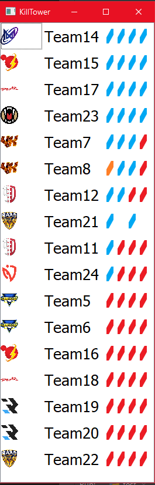

**KillTower**

KillTower is a program that tracks the live state of players in a PUBG mobile game. It displays the live state of each player in a table that can be sorted by team and number of live players. The program can read data from a local mockup file or a URL.

**Features**

- Display the live state of each player in a table that can be sorted by team and number of live players.
- Can read data from a local mockup file or a URL.
- Each row of the table displays the logo of the team, the name of the team, and the live state of each player.
- The live state of each player is displayed using icons that represent whether the player is alive, knocked out, or dead.
- The table can be resized based on the content.
- The program uses PyQt5 for the user interface.
- The program is cross-platform and can be run on Windows, Linux, and macOS.
- The program updates the data every 1 second.
- Abilty to bring custom fonts, backgrounds, and manny other visual modifications

**Screenshot**

**Diagram**

**Usage**

1. Install Python 3.x on your computer.
1. Install the required packages by running the following command in your terminal: pip install PyQt5 requests.
1. Clone or download the repository to your computer.
1. Open a terminal in the directory where you cloned the repository.
1. Run the program by typing python killtower.py in your terminal.

**License**

This project is licensed under the MIT License. See the LICENSE file for details.
